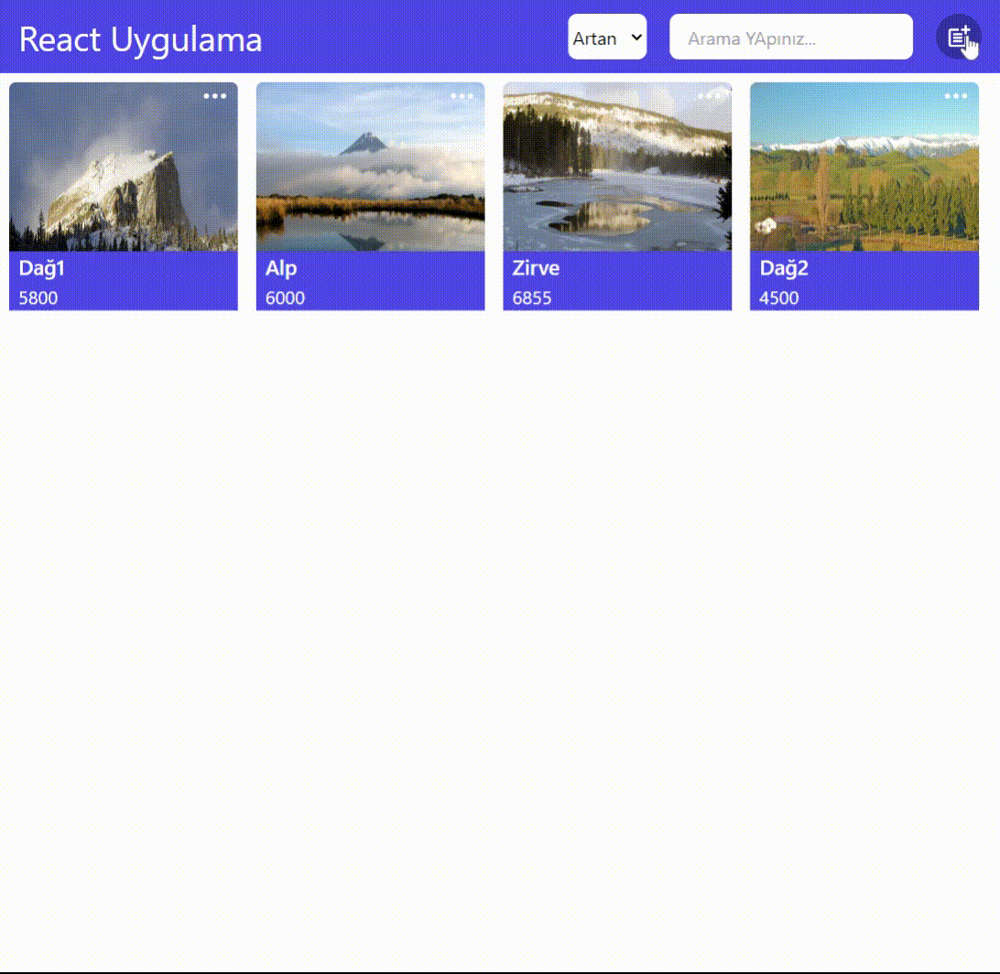

# Redux Toolkit ile Ürün oluştuma, Ürün Silme ve Ürün Güncelleme Projesi

# Kullanılan Kütüphaneler

    "@reduxjs/toolkit": "^2.2.4",
    "react": "^18.2.0",
    "react-dom": "^18.2.0",
    "react-icons": "^5.2.1",
    "react-redux": "^9.1.2",
    "react-router-dom": "^6.23.1"

# Yapılan İşlemler

-Header ayrı bir component olarak oluşturuldu.
-Buton, input, modal, productcard bileşenleri component olarak oluşturuldu.

# ReactReduxProje
